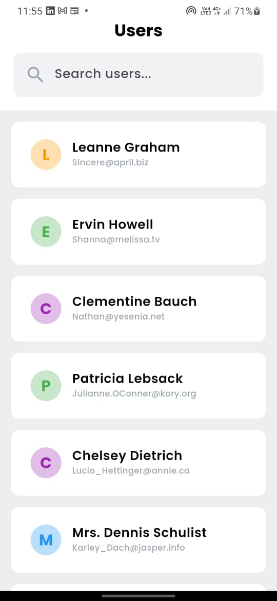
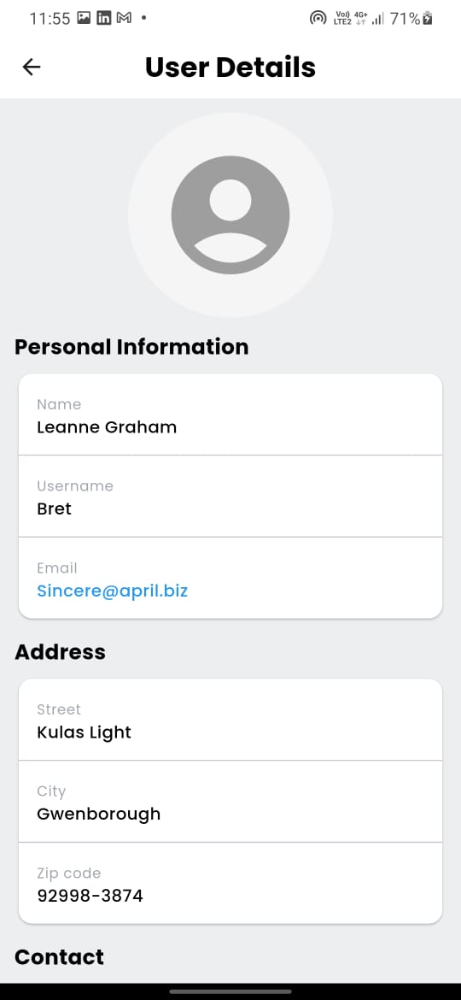

# USER DETAILS APP

This is mobile application for fetching the users and display the user details.

## Getting Started

To set up the Flutter application locally, follow these steps:

### 1.Install Dependencies

Run the following command to install the necessary dependencies:

    flutter pub get

### 2. Run the Application

For debug mode:

    flutter run

For release mode:

    flutter run --release

## Screenshots

### User Screen

### User Details Screen

